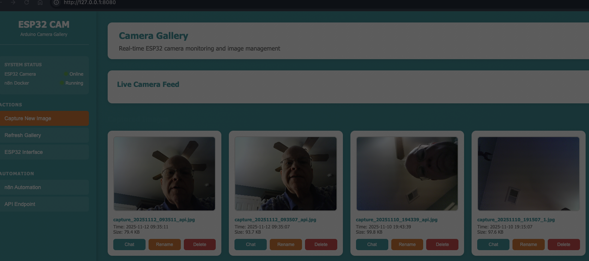

# 📷 ESP32-WROVER-DEV Camera Web Server

> **Built by Glenn Mossy** 🚀  
> Turn your ESP32-WROVER-DEV into a powerful IoT camera with web interface, API endpoints, and n8n automation!

[](https://www.espressif.com/)
[](https://www.arduino.cc/)
[](https://www.python.org/)
[](LICENSE)

## 📸 Screenshots


*Modern Arduino-branded UI with real-time system status monitoring*

## 🎯 What is This?

This is a **complete IoT camera system** running on the **Freenove ESP32-WROVER-DEV** board with built-in OV2640 camera module. Transform your ESP32 into a smart security camera with web interface, RESTful API, and automation capabilities!

### What Makes This Special?

Unlike simple camera examples, this project provides:

- **Production-Ready Code**: Secure credential management with `.env` files
- **Full Web Interface**: Python-based gallery with live feed, image management, and API
- **Hardware Diagnostics**: Comprehensive test suite to verify your board
- **Automation Ready**: Built for n8n workflows and AI integration
- **Power Optimized**: Low-power variant for battery operation

### Real-World Use Cases

- 📸 **Smart Security Camera** - Capture images on demand or on schedule
- 🤖 **AI Integration** - Send images to OpenAI Vision, AWS Rekognition, or Google Vision
- 🏷️ **Auto-Labeling** - Automatically categorize and tag images based on content
- 📊 **Visitor Tracking** - Monitor who comes to your door with motion detection
- 🌱 **Time-Lapse Projects** - Track plant growth, construction, or weather
- 🔔 **Smart Alerts** - Get notified via email/Slack when motion is detected
- 🌐 **Remote Monitoring** - Access from anywhere on your network

### ✨ Features That'll Make You Smile

- 📸 **Live Camera Feed** - See what your ESP32 sees in real-time
- 🌐 **Web Interface** - Beautiful gallery to view, rename, and delete images
- 🤖 **API Endpoints** - Perfect for n8n automation and AI integration
- 💾 **Auto-Save Images** - Captures stored with timestamps
- 🏷️ **Smart Labeling** - Rename images with custom labels
- ⚡ **Low Power Mode** - Optimized for battery operation
- 🔄 **Auto-Refresh** - Live feed updates every 5 seconds
- 🗑️ **Image Management** - Delete unwanted captures with one click
- 📡 **RESTful API** - JSON responses for easy integration

## 🛠️ Hardware You'll Need

- **Freenove ESP32-WROVER-DEV Board** with built-in camera (OV2640)
  - ESP32-D0WD-V3 chip (revision v3.0)
  - Wi-Fi, BT 5 (LE), Dual Core + LP Core, 240MHz
  - 4MB Flash, PSRAM support
  - Built-in OV2640 camera module
- USB cable (for programming and power)
- WiFi network (2.4GHz - ESP32 doesn't support 5GHz)
- Computer with Arduino IDE or arduino-cli

## 🚀 Quick Start Guide

### Step 1: Install Prerequisites

```bash
# Install ESP32 board support
arduino-cli core install esp32:esp32

# Verify Python 3 is installed
python3 --version
```

### Step 2: Clone and Configure

```bash
# Clone this repository
git clone https://github.com/gmossy/ESP32-WROVER-DEV.git
cd ESP32-WROVER-DEV

# Copy environment template
cp .env.example .env

# Edit .env with your WiFi credentials
nano .env  # or use your preferred editor
```

Update these values in `.env`:

```bash
WIFI_SSID=YOUR_WIFI_NAME
WIFI_PASSWORD=YOUR_WIFI_PASSWORD
ESP32_IP=10.0.0.30
ESP32_GATEWAY=10.0.0.1
ESP32_SUBNET=255.255.255.0
```

### Step 3: Run Hardware Test (Recommended)

Before uploading the camera server, verify your board works:

```bash
# Find your ESP32 port
arduino-cli board list

# Compile and upload hardware test
cd hardware_test
arduino-cli compile --fqbn esp32:esp32:esp32wrover .
arduino-cli upload --fqbn esp32:esp32:esp32wrover --port /dev/cu.usbserial-143130 --upload-property upload.speed=115200 .

# Monitor serial output
arduino-cli monitor -p /dev/cu.usbserial-143130 -c baudrate=115200
```

**What the hardware test does:**

- ✅ Verifies chip info (model, revision, memory)
- ✅ Tests LED functionality with blink pattern
- ✅ Tests serial I/O (type "TEST" when prompted)
- ✅ Displays PSRAM detection
- ✅ Shows continuous heartbeat and memory stats

> **Note:** Replace `/dev/cu.usbserial-143130` with your actual port from `arduino-cli board list`

### Step 4: Generate Config and Upload Camera Server

```bash
# Generate config.h files from .env
python3 generate_config.py

# Upload camera webserver
cd camera_webserver
arduino-cli compile --fqbn esp32:esp32:esp32wrover .
arduino-cli upload --fqbn esp32:esp32:esp32wrover --port /dev/cu.usbserial-143130 --upload-property upload.speed=115200 .
```

### Step 5: Start the Image Viewer

```bash
# Return to project root
cd ..

# Start the Python web server
python3 view_captures.py
```

### Step 6: Access Your Camera

Open your browser:
- **ESP32 Camera Interface:** <http://10.0.0.30>
- **Image Gallery & API:** <http://127.0.0.1:8080>

**That's it!** You're now running a full-featured camera system! 🎉

## 📸 Using the Camera

### Web Interface

The image gallery at <http://127.0.0.1:8080> provides:

- **Live Feed**: Auto-refreshing camera view
- **Image Gallery**: All captured images with metadata
- **Rename**: Click 🏷️ to add custom labels
- **Delete**: Click 🗑️ to remove images
- **Full Screen**: Click any image to view full-size

### API Endpoints

Perfect for automation and integration:

| Endpoint | Method | Purpose |
|----------|--------|---------|
| `/api/capture` | GET | Capture & save new image |
| `/api/images` | GET | List all images with metadata |
| `/api/rename` | POST | Rename/relabel an image |
| `/api/delete/{filename}` | DELETE | Delete specific image |

### Command Line

```bash
# Capture image
curl http://127.0.0.1:8080/api/capture

# List all images
curl http://127.0.0.1:8080/api/images

# Get image directly from ESP32
curl http://10.0.0.30/capture -o image.jpg
```

## 🤖 n8n Automation

This project is designed to work seamlessly with n8n workflows!

### Example Workflows

#### 1. Scheduled Capture Every 5 Minutes

```
Schedule Trigger (*/5 * * * *)
  ↓
HTTP Request (GET /api/capture)
  ↓
Set Node (extract filename)
```

#### 2. AI-Powered Auto-Labeling

```
Webhook Trigger
  ↓
HTTP Request (GET /api/capture)
  ↓
HTTP Request (download image)
  ↓
OpenAI Vision (analyze image)
  ↓
Function (create label)
  ↓
HTTP Request (POST /api/rename)
```

#### 3. Motion Detection Alert

```
Webhook (motion sensor)
  ↓
HTTP Request (GET /api/capture)
  ↓
Send Email/Slack (with image)
```

**See [n8n/N8N_INTEGRATION.md](n8n/N8N_INTEGRATION.md) for complete guide!**

## 📁 Project Structure

```text
ESP32-webserver/
├── README.md                    # You are here!
├── .env                         # WiFi credentials (not in git)
├── .env.example                 # Template for credentials
├── generate_config.py           # Generates config.h from .env
├── view_captures.py             # Image gallery web server
├── Makefile                     # Build automation
├── CONFIGURATION.md             # Detailed setup guide
├── API_QUICK_REFERENCE.md       # Quick API reference
│
├── camera_webserver/            # 📸 Main Production Sketch
│   ├── camera_webserver.ino    # Camera web server code
│   └── config.h                # Auto-generated (not in git)
│
├── low_power_webserver/         # ⚡ Power-Optimized Version
│   ├── low_power_webserver.ino # Low power camera server
│   └── config.h                # Auto-generated (not in git)
│
├── hardware_test/               # 🔧 Board Diagnostics
│   └── hardware_test.ino       # Comprehensive hardware test
│
├── low_power/                   # 🔋 Power Test (no WiFi)
│   └── low_power.ino           # Ultra low power test
│
├── n8n/                        # 🤖 Automation & Docker
│   ├── README.md               # Docker setup guide
│   ├── N8N_INTEGRATION.md      # n8n workflow guide
│   ├── docker-compose.yml      # Docker services
│   └── Dockerfile.viewer       # Image viewer container
│
├── docs/                       # 📚 Documentation
│   └── images/                 # Screenshots
│
└── captures/                   # 💾 Saved images folder
```

### Sketch Overview

| Sketch | Purpose | WiFi | Camera |
|--------|---------|------|--------|
| `camera_webserver` | Main production camera server | ✅ | ✅ |
| `low_power_webserver` | Battery-optimized camera server | ✅ | ❌ |
| `hardware_test` | Board diagnostics & verification | ❌ | ❌ |
| `low_power` | Ultra low power test (no WiFi) | ❌ | ❌ |

## 🔧 Configuration

### WiFi Settings (Secure Method)

This project uses `.env` files to keep credentials out of your code:

**1. Edit `.env` file:**

```bash
WIFI_SSID=YOUR_WIFI_NAME
WIFI_PASSWORD=YOUR_WIFI_PASSWORD
ESP32_IP=10.0.0.30
ESP32_GATEWAY=10.0.0.1
ESP32_SUBNET=255.255.255.0
```

**2. Generate config files:**

```bash
python3 generate_config.py
```

This creates `config.h` files in each sketch directory:

```cpp
// Auto-generated config.h (not committed to git)
const char* ssid = "YOUR_WIFI_NAME";
const char* password = "YOUR_WIFI_PASSWORD";
IPAddress local_IP(10, 0, 0, 30);
IPAddress gateway(10, 0, 0, 1);
IPAddress subnet(255, 255, 255, 0);
```

> **Security Note:** `config.h` files are in `.gitignore` and will NOT be committed to version control!

### Camera Settings

Adjust image quality and resolution:

```cpp
config.frame_size = FRAMESIZE_UXGA;  // Resolution
config.jpeg_quality = 10;            // Quality (10=high, 63=low)
config.fb_count = 2;                 // Frame buffers
```

Available resolutions:

- `FRAMESIZE_UXGA` (1600x1200) - Highest quality
- `FRAMESIZE_SVGA` (800x600) - Balanced
- `FRAMESIZE_VGA` (640x480) - Lower bandwidth
- `FRAMESIZE_QVGA` (320x240) - Fastest

### Server Port

Change the Python server port in `view_captures.py`:

```python
PORT = 8080  # Change to your preferred port
```

## 🧪 Testing & Diagnostics

### Hardware Test (Recommended First Step)

Before deploying the camera server, run the comprehensive hardware test:

```bash
cd hardware_test
arduino-cli compile --fqbn esp32:esp32:esp32wrover .
arduino-cli upload --fqbn esp32:esp32:esp32wrover --port /dev/cu.usbserial-143130 --upload-property upload.speed=115200 .
arduino-cli monitor -p /dev/cu.usbserial-143130 -c baudrate=115200
```

**The hardware test verifies:**

#### TEST 1: Chip Information

- Chip model and revision
- Flash and PSRAM size
- Free heap memory
- CPU frequency
- MAC address

#### TEST 2: LED Hardware

- 3-blink pattern test
- Visual confirmation LED works
- Serial feedback for each blink

#### TEST 3: Serial I/O

- Interactive input test
- Type "TEST" when prompted
- Verifies serial communication

#### Continuous Monitoring

- Heartbeat LED blink (1 second)
- Periodic uptime and memory reports
- Dots printed every second

### Camera Server Tests

Once the camera server is running:

```bash
# Test camera directly from ESP32
curl http://10.0.0.30/capture -o test.jpg

# Verify image was captured
open test.jpg  # macOS
# or
xdg-open test.jpg  # Linux

# Check if image viewer API is running
curl http://127.0.0.1:8080/api/images

# Capture via API (saves to captures/ folder)
curl http://127.0.0.1:8080/api/capture

# Monitor ESP32 serial output
arduino-cli monitor -p /dev/cu.usbserial-143130 -c baudrate=115200
```

### Network Diagnostics

```bash
# Check if ESP32 is on network
ping 10.0.0.30

# Check if port 80 is open
nc -zv 10.0.0.30 80

# Find your ESP32 port
arduino-cli board list
```

## 🎓 Learning Resources

### Understanding the Code

**Camera Initialization** (`camera_webserver.ino`):
```cpp
void setupCamera() {
  camera_config_t config;
  // Configure camera pins for Freenove WROVER
  config.pin_d0 = Y2_GPIO_NUM;
  config.pin_d1 = Y3_GPIO_NUM;
  // ... more pin configurations
  
  esp_err_t err = esp_camera_init(&config);
  if (err != ESP_OK) {
    Serial.printf("Camera init failed: 0x%x\n", err);
  }
}
```

**Image Capture** (`camera_webserver.ino`):
```cpp
void handleCapture() {
  camera_fb_t * fb = esp_camera_fb_get();  // Get frame buffer
  if(!fb) {
    Serial.println("Camera capture failed");
    return;
  }
  
  // Send JPEG data
  server.send_P(200, "image/jpeg", (const char *)fb->buf, fb->len);
  
  esp_camera_fb_return(fb);  // Return buffer
}
```

**API Endpoint** (`view_captures.py`):
```python
def do_GET(self):
    if self.path == '/api/capture':
        # Capture from ESP32
        req = urllib.request.Request('http://10.0.0.30/capture')
        with urllib.request.urlopen(req) as response:
            image_data = response.read()
            # Save with timestamp
            filename = f"capture_{timestamp}_api.jpg"
            with open(filename, 'wb') as f:
                f.write(image_data)
```

### Key Concepts

1. **Frame Buffer**: Temporary memory holding camera image
2. **JPEG Compression**: Reduces image size for transmission
3. **Static IP**: Fixed address for reliable access
4. **RESTful API**: Standard HTTP methods for operations
5. **CORS Headers**: Allow cross-origin requests

## 🐛 Troubleshooting

### Camera Not Initializing

**Error:** `Camera init failed with error 0x...`

**Solutions:**
- Check camera ribbon cable connection
- Verify pin configuration matches your board
- Try different frame size (SVGA instead of UXGA)
- Check if PSRAM is detected: `psramFound()`

### WiFi Not Connecting

**Error:** `WiFi connection failed`

**Solutions:**
- Verify SSID and password are correct
- Ensure using 2.4GHz network (not 5GHz)
- Check WiFi signal strength
- Try without static IP first
- Monitor serial output for details

### Upload Fails

**Error:** `Could not open port` or `chip stopped responding`

**Solutions:**
- Hold BOOT button while uploading
- Use slower baud rate: `--upload-property upload.speed=115200`
- Try different USB cable
- Check port with: `arduino-cli board list`
- Erase flash first: `esptool --port /dev/cu.usbserial-143130 erase_flash`

### Images Not Saving

**Solutions:**
- Check `captures/` folder exists and is writable
- Verify ESP32 is accessible: `ping 10.0.0.30`
- Check Python server is running
- Look for errors in server output

### Browser Can't Connect

**Solutions:**
- Use `http://` not `https://`
- Disable browser HTTPS-only mode
- Try different browser or incognito mode
- Check firewall settings
- Verify server is running: `curl http://127.0.0.1:8080`

## 🔒 Security Notes

- **Local Network Only**: Server runs on localhost by default
- **No Authentication**: Add API keys for production use
- **Plain HTTP**: Use reverse proxy with SSL for public access
- **Firewall**: Restrict access to trusted devices
- **Credentials**: Don't commit WiFi passwords to public repos!

## 🚀 Advanced Usage

### Custom Image Processing

Add image processing in `view_captures.py`:

```python
from PIL import Image
import io

def process_image(image_data):
    img = Image.open(io.BytesIO(image_data))
    # Resize, filter, or analyze
    img = img.resize((640, 480))
    return img
```

### Webhook Integration

Trigger captures from external services:

```bash
curl -X POST http://your-n8n-server:5678/webhook/esp32-capture
```

### Database Storage

Store image metadata in SQLite:

```python
import sqlite3

conn = sqlite3.connect('images.db')
cursor = conn.cursor()
cursor.execute('''
    CREATE TABLE IF NOT EXISTS images (
        id INTEGER PRIMARY KEY,
        filename TEXT,
        timestamp REAL,
        label TEXT,
        size INTEGER
    )
''')
```

## 📊 Performance

- **Image Capture Time**: ~500ms
- **JPEG Compression**: 10-15x reduction
- **Typical Image Size**: 80-120KB
- **Network Latency**: 50-200ms (local network)
- **Power Consumption**: 
  - Active (WiFi + Camera): ~300mA
  - Low Power Mode: ~150mA
  - Deep Sleep: ~10μA

## 🤝 Contributing

Found a bug? Have an idea? Contributions welcome!

1. Fork the repository
2. Create your feature branch: `git checkout -b feature/amazing-feature`
3. Commit your changes: `git commit -m 'Add amazing feature'`
4. Push to the branch: `git push origin feature/amazing-feature`
5. Open a Pull Request

## 📜 License

This project is licensed under the MIT License - see the [LICENSE](LICENSE) file for details.

## 🙏 Acknowledgments

- **Espressif** for the amazing ESP32 platform
- **Freenove** for the WROVER-DEV board
- **Arduino** community for libraries and support
- **n8n** for workflow automation inspiration

## 📧 Contact

**Glenn Mossy**
- GitHub: [@gmossy](https://github.com/gmossy)

## 🌟 Star This Repo!

If you found this project helpful, please give it a star! ⭐

It helps others discover this project and motivates me to create more awesome IoT projects!

---

**Happy Coding!** 🚀📷

*Built with ❤️ by Glenn Mossy*
