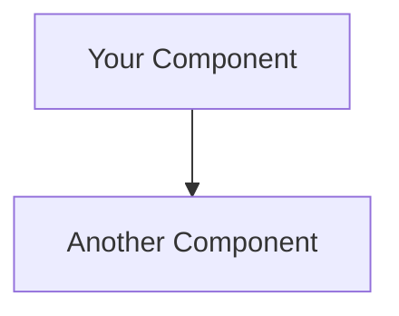

# ESP32 Camera System - Documentation

This folder contains comprehensive architectural documentation and diagrams for the ESP32 Camera System.

## 📄 Documentation Files

### [architecture.md](./architecture.md)
Complete architectural documentation with **7 interactive Mermaid diagrams**:

1. **System Architecture Overview** - High-level component view
2. **Component Interaction Flow** - Sequence diagram of operations
3. **Data Flow Architecture** - How data moves through the system
4. **API Architecture** - FastAPI endpoint structure
5. **Deployment Architecture** - Docker container layout
6. **Sensor Integration Architecture** - IoT sensor framework
7. **Security Architecture** - Security layers and future auth
8. **Technology Stack** - Mindmap of all technologies

### [architecture.excalidraw.json](./architecture.excalidraw.json)
Excalidraw format diagram that can be:
- Opened in [Excalidraw](https://excalidraw.com)
- Edited and customized
- Exported to PNG/SVG
- Shared with team members

**To use:**
1. Go to https://excalidraw.com
2. Click "Open" → "Load from file"
3. Select `architecture.excalidraw.json`
4. Edit and export as needed

### [architecture.svg](./architecture.svg)
Standalone SVG diagram showing:
- ESP32 hardware layer
- FastAPI backend service
- n8n automation engine
- Image viewer service
- Storage volumes
- OpenAI integration
- Web browser client
- Component connections

**Features:**
- ✅ Scalable vector graphics
- ✅ Can be embedded in documentation
- ✅ Viewable in any browser
- ✅ Color-coded components
- ✅ Legend included

## 🎨 Viewing the Diagrams

### Mermaid Diagrams (architecture.md)
View in:
- **GitHub** - Renders automatically
- **VS Code** - Install "Markdown Preview Mermaid Support" extension
- **Online** - Copy to [Mermaid Live Editor](https://mermaid.live)

### Excalidraw Diagram
1. Download the JSON file
2. Open https://excalidraw.com
3. Load the file
4. Edit or export

### SVG Diagram
- **Browser**: Open `architecture.svg` directly
- **Markdown**: Embed with ``
- **HTML**: Use ``

## 📊 Diagram Types

### System Architecture Overview
Shows the complete system with all components:
- Hardware (ESP32, sensors)
- Docker services (backend, n8n, viewer)
- Storage (volumes)
- External services (OpenAI)
- Client layer (browser, API clients)

### Sequence Diagram
Illustrates the flow of operations:
1. User captures image
2. Backend communicates with ESP32
3. Image saved to storage
4. AI analysis triggered
5. n8n workflow executes
6. Notifications sent

### Data Flow
Tracks how data moves:
- Input sources (camera, sensors, user)
- Processing layers (ESP32, API, workflows)
- Intelligence (AI, business rules)
- Output destinations (storage, notifications, display)

## 🔧 Customizing Diagrams

### Mermaid
Edit the code blocks in `architecture.md`:


### Excalidraw
1. Open in Excalidraw
2. Modify shapes, colors, text
3. Export as PNG, SVG, or JSON
4. Replace the file

### SVG
Edit `architecture.svg` in any text editor or vector graphics tool:
- Inkscape (free)
- Adobe Illustrator
- Figma (import SVG)

## 📚 Additional Resources

### Architecture Documentation
- [Backend README](../backend/README.md)
- [API Endpoints](../backend/API_ENDPOINTS.md)
- [Deployment Guide](../backend/DEPLOYMENT.md)

### Main Documentation
- [Project README](../README.md)
- [Configuration Guide](../CONFIGURATION.md)
- [API Quick Reference](../API_QUICK_REFERENCE.md)

## 🎯 Use Cases for Diagrams

### For Development
- Understanding system architecture
- Planning new features
- Debugging issues
- Code reviews

### For Documentation
- README files
- Wiki pages
- Technical specifications
- Onboarding materials

### For Presentations
- Team meetings
- Stakeholder demos
- Technical talks
- Project proposals

## 🖼️ Exporting Diagrams

### From Mermaid
```bash
# Install mermaid-cli
npm install -g @mermaid-js/mermaid-cli

# Export to PNG
mmdc -i architecture.md -o architecture.png

# Export to SVG
mmdc -i architecture.md -o architecture-mermaid.svg
```

### From Excalidraw
1. Open the JSON file
2. Click "Export image"
3. Choose format (PNG, SVG, or clipboard)
4. Save or copy

### SVG to PNG
```bash
# Using ImageMagick
convert architecture.svg architecture.png

# Using Inkscape
inkscape architecture.svg --export-filename=architecture.png
```

## 🤝 Contributing

To update diagrams:

1. **Mermaid**: Edit `architecture.md` directly
2. **Excalidraw**: Edit JSON, export, and commit
3. **SVG**: Edit file and commit changes

## 📝 Diagram Conventions

### Colors
- 🔵 **Blue (#4a90e2)** - Hardware/ESP32
- 🟢 **Green (#50c878)** - Backend/API
- 🔴 **Red (#ff6b6b)** - n8n/Automation
- 🟡 **Yellow (#ffd93d)** - Viewer/UI
- 🟣 **Purple (#9b59b6)** - AI/External Services
- ⚪ **Gray (#ecf0f1)** - Storage/Data

### Shapes
- **Rectangles** - Services/Components
- **Cylinders** - Databases/Storage
- **Arrows** - Data flow/Communication
- **Diamonds** - Decision points

---

**For questions or updates, see the main [README](../README.md)**
