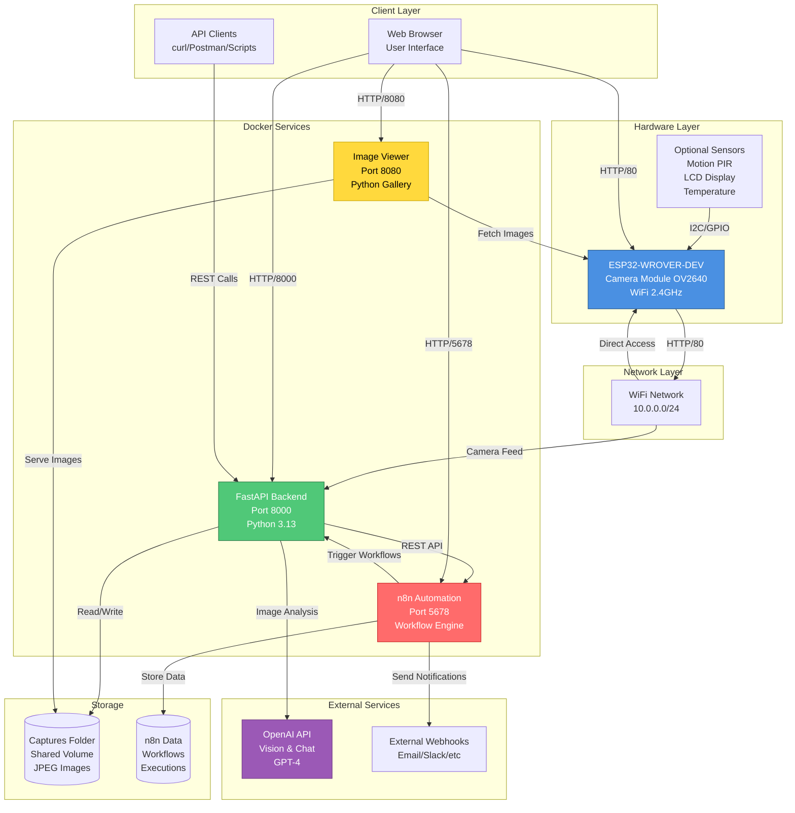
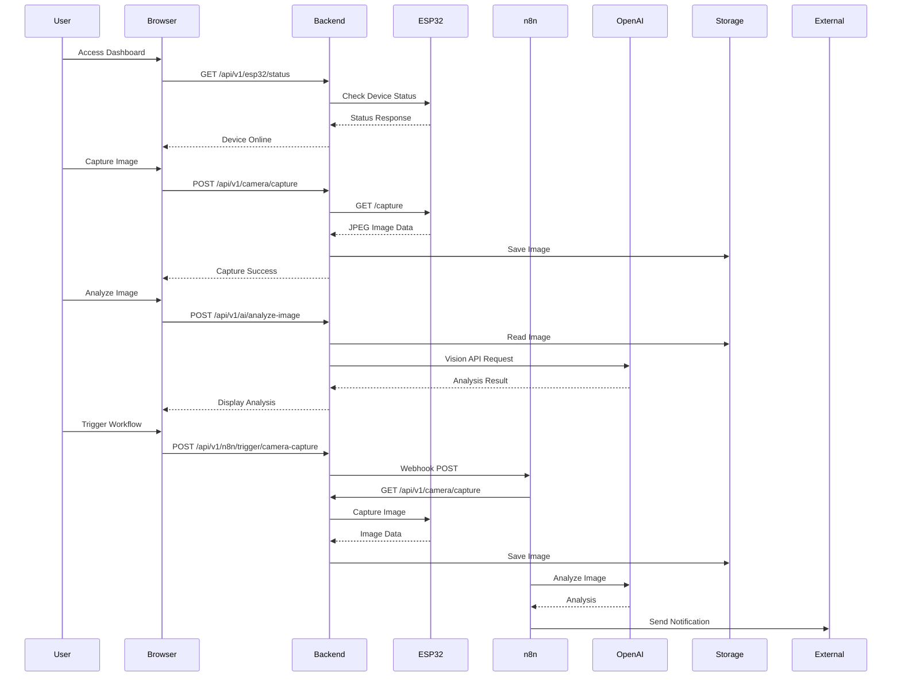
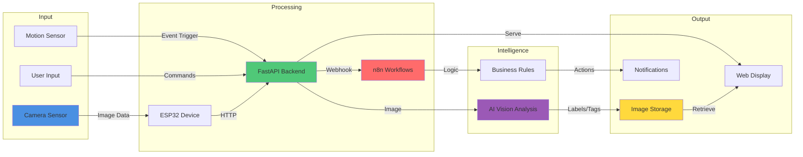
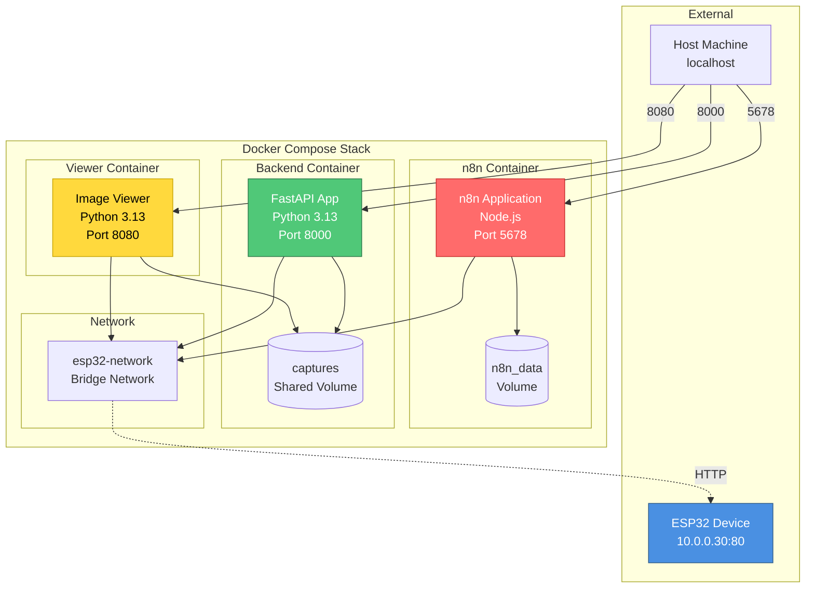
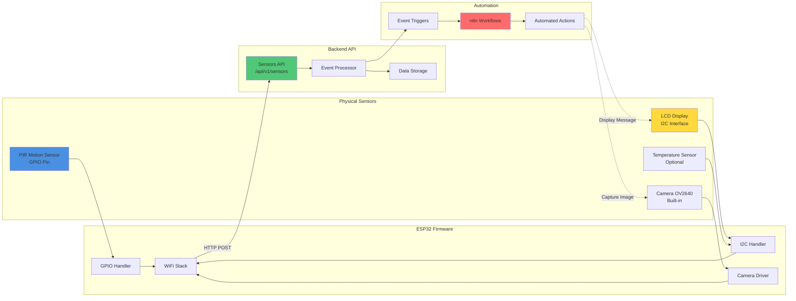
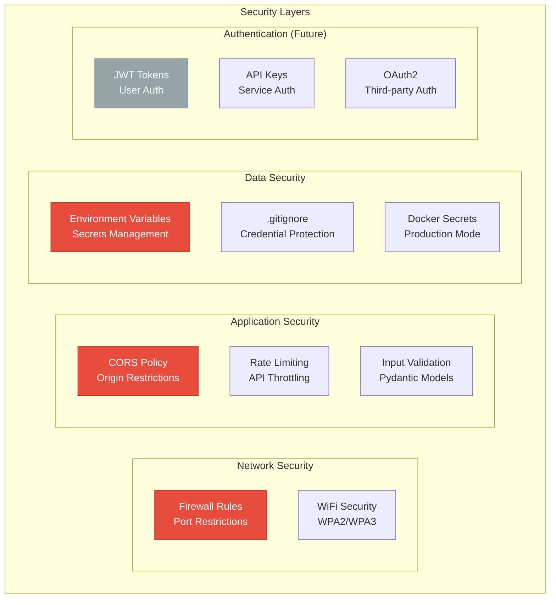
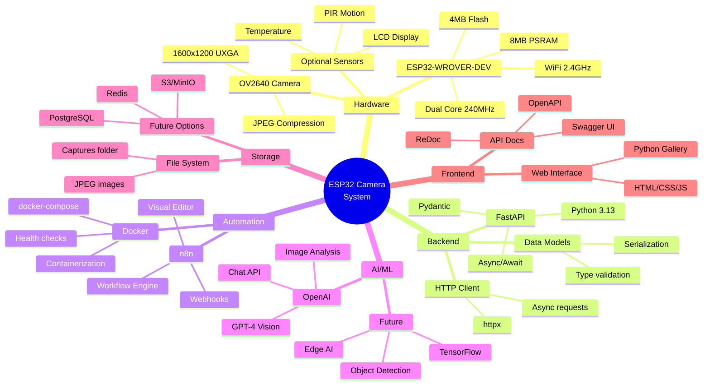

# ESP32 Camera System - Architecture Documentation

## System Architecture Overview



## Component Interaction Flow



## Data Flow Architecture



## API Architecture

```mermaid
graph TB
    subgraph "API Gateway - FastAPI"
        MAIN[main.py<br/>FastAPI App<br/>Port 8000]
        
        subgraph "API Routes /api/v1"
            CAMERA[/camera<br/>8 endpoints<br/>Image operations]
            ESP32[/esp32<br/>7 endpoints<br/>Device management]
            N8N[/n8n<br/>9 endpoints<br/>Workflow integration]
            SENSORS[/sensors<br/>10 endpoints<br/>Sensor data]
            AI[/ai<br/>5 endpoints<br/>Vision & Chat]
        end
        
        subgraph "Core Services"
            CONFIG[Configuration<br/>Environment vars<br/>Settings]
            LOGGING[Logging<br/>Request tracking<br/>Error handling]
        end
        
        subgraph "Data Models"
            PYDANTIC[Pydantic Models<br/>Validation<br/>Serialization]
        end
    end
    
    MAIN --> CAMERA
    MAIN --> ESP32
    MAIN --> N8N
    MAIN --> SENSORS
    MAIN --> AI
    
    CAMERA --> CONFIG
    ESP32 --> CONFIG
    N8N --> CONFIG
    SENSORS --> CONFIG
    AI --> CONFIG
    
    CAMERA --> LOGGING
    ESP32 --> LOGGING
    N8N --> LOGGING
    SENSORS --> LOGGING
    AI --> LOGGING
    
    CAMERA --> PYDANTIC
    ESP32 --> PYDANTIC
    N8N --> PYDANTIC
    SENSORS --> PYDANTIC
    AI --> PYDANTIC
    
    style MAIN fill:#50c878,stroke:#2d7a4a,color:#fff
    style CAMERA fill:#4a90e2,stroke:#2e5c8a,color:#fff
    style ESP32 fill:#4a90e2,stroke:#2e5c8a,color:#fff
    style N8N fill:#ff6b6b,stroke:#c92a2a,color:#fff
    style SENSORS fill:#ffd93d,stroke:#c9a500,color:#000
    style AI fill:#9b59b6,stroke:#6c3483,color:#fff
```

## Deployment Architecture



## Sensor Integration Architecture



## Security Architecture



## Technology Stack



---

## Key Architectural Decisions

### 1. **Microservices Architecture**
- Separate containers for backend, n8n, and viewer
- Independent scaling and deployment
- Clear separation of concerns

### 2. **RESTful API Design**
- Versioned API (`/api/v1`)
- Resource-based endpoints
- Standard HTTP methods

### 3. **Event-Driven Integration**
- Webhooks for n8n integration
- Sensor events trigger workflows
- Asynchronous processing

### 4. **Shared Storage**
- Docker volumes for image persistence
- Accessible by all services
- Simple backup/restore

### 5. **Extensible Sensor Framework**
- Generic sensor reading API
- Easy to add new sensor types
- Flexible metadata support

### 6. **Security by Design**
- Credentials in environment variables
- `.gitignore` for sensitive files
- Health checks for monitoring
- Ready for authentication layer

---

**For implementation details, see:**
- [Backend README](../backend/README.md)
- [API Endpoints](../backend/API_ENDPOINTS.md)
- [Deployment Guide](../backend/DEPLOYMENT.md)
